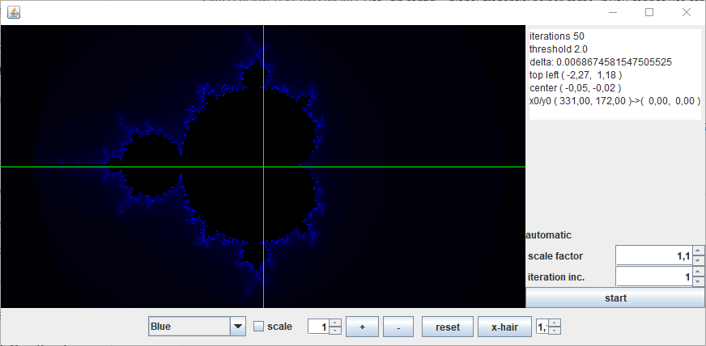

# Mandelbrot
Visualizes mandelbrot sets using java swing

## The Mandelbrot set
The calculator is located in the <tt>Mandelbrot</tt> class. 
The calculation can be controlled via two parameters
* the maximum number of iterations that are calulated (default is 50)
* the threshold that defines divergency of the function (default is 2.0)

## Application
Execute <tt>main</tt> in the <tt>Application</tt> class.

A swing window opens that shows the blue outline of a madelbrot set. 
On the eastern area of the window a plaintext area shows some data about the settings.

### Controls
On the southern area there's a button pane with the following controls
* colour - a combobox to choose the colouring scheme
* scale - controls the colour brightness, please refer to the code for details
* iteration increment - a spinner for stting the increment count
* <tt>+</tt> - increment the iteration count by the spinner value
* <tt>-</tt> - decrement the iteration count by the spinner value
* reset - recover the initial state of the image
* x-hair - toggles the visibility of the green reticle

And there's an ugly spinner for setting the scale factor...

### Mouse control
* Clicking anywhere in the image area centers the image around this point.
* Scrolling up zooms into the image
* Scrolling down zooms out of the image

The zoom factor is set to 1.1 and is set using the ugly spinner on the right hand side of the button pane.

The zoom tries to keep the center of the image where it is.
This is not always accurate, especially when you zoom deep into the image.
Calculation might be improved in the future.  

## Colouring
The method <tt>Fractal.toColor(int)</tt> calculates the color from the number of iterations
after which the function passed the threshold. 
Currently the image is monochrome with different shades of blue.
Non divergent points are coloured black.

The "scale" checkbox tries to control the calculation of the colors... It's still experimental.

## automatic change
The AutoPanel control group an the right hand side uses a Timer object to redraw the mandelbrot set
every second. The start/stop-toggle button starts and stops it. 
The two spinners control the scale factor (>1 zoom in, <1 zooms out) and the in-/decrementation of
the iteration number with each repainting.
